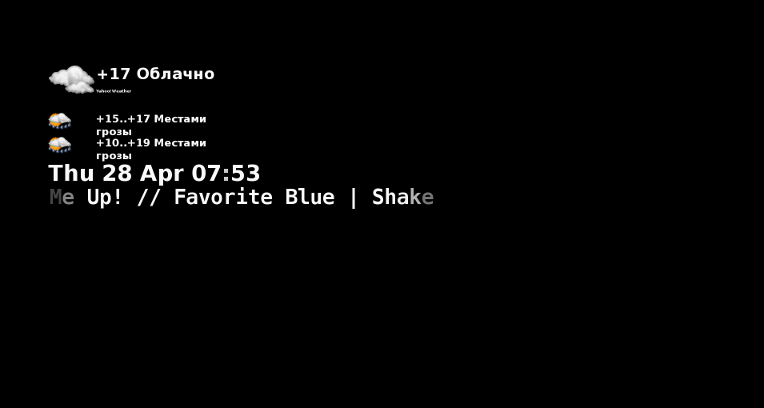
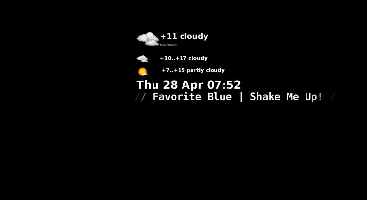

The Rubysaver
=============

Features
--------

Works as Xscreensaver module. Shows current weather, forecast and tomorrow forecast. Shows clock. If your mpris.MediaPlayer2 compatible player (most of popular players) is playing, shows current track title and performer.

After sunset can display all darker (default) to less disturb you. If you don't want it, set weather_image_alpha and weather_image_noalpha to same value (e.g. 255.0).

Screenshots
-----------




Pre-requisites
--------------

- Ruby 1.9.1+
- ruby gems: gtk2, dbus
- xscreensaver or compatible

You can install them via packages. E.g. for debian/ubuntu: `apt-get install ruby ruby-gtk2 ruby-dbus`

Or you can install rbenv (`curl https://raw.githubusercontent.com/fesplugas/rbenv-installer/master/bin/rbenv-installer | bash`), then
install ruby (e.g. 2.2.0: `rbenv install 2.2.0; `rbenv global 2.2.0`), and gems: `gem install gtk2; gem install dbus; gem install rcairo`.

Installing
----------

Just `mkdir /opt/rubysaver` (you can choose another directory), then copy rs.rb and iconsbest.com-icons there:
`cp -r rs.rb iconsbest.com-icons/ /opt/rubysaver`. Make rs.rb executable: `chmod a+x /opt/rubysaver/rs.rb`.
Create ~/.config/rubysaver.conf, and fil your localtion, e.g.:

```
place: Tokyo,JP
```

Edit ~/.xscreensaver, find line 'programs:' and put just after it: `/opt/rubysaver/rs.rb \n\`. Modify lines:

```
mode:           one
selected:       0
```

That's all! Just lock your screen or start xscreensaver. If you're using xscreensaver compatible saver,
specify /opt/rubysaver/rs.rb as active module.


Customizing
-----------

You can change many options in ~/.config/rubysaver.conf: (yaml format)

```
# path to icons
icon_path: /opt/rubysaver/iconsbest.com-icons
# name for weather font
font_face: Sans Serif
# weight for weather font
font_weight: bold
# font size for forecasts
weather_font_size: 20
# font size for current weather
weather_big_font_size: 38
# font name for clock
font_face_clock: Sans Serif
# font weight for clock
font_weight_clock: ultrabold
# font size for clock
weather_clock_font_size: 42
# font name for 'now playing' string. Use ONLY monosized fonts!
font_face_play: Mono
# font weight for 'now playing' string
font_weight_play: normal
# font size for 'now playing' string
play_font_size: 40
# font size for REQUIRED reference to Yahoo.
yahoo_font_size: 8

# alpha level for tinted image (after sunset)
weather_image_alpha: 100.0
# alpha level for normal image (after sunrise)
weather_image_noalpha: 255.0
# speed of sliding in x and y direction
xspeed: 2
yspeed: 2

# your place (see Yahoo!Weather)
place: Tokyo,JP
# if Yahoo finds several cities, select yours by right index
place_index: 1
# currently only english and russian are supported. Send my pull requests for more!
lang: english

# speed of 'now playing' scrolling
np_speed: 5
# maximum 'now playing' string length
max_play_len: 48
# weather update interval in seconds. Don't ask Yahoo often!
update_interval: 1200
# weather update interval in seconds if last update failed
update_interval: 120
# sunrise time, if yahoo didn't say it
min_tint_hour: 6
# sunset time, if yahoo didn't say it
max_tint_hour: 22

# background color red 0..255 (default 0)
bg_red: 0
# background color green 0..255 (default 0)
bg_green: 0
# background color blue 0..255 (default 0)
bg_blue: 0

# if 1, then do not move image, just center it
stop_mode: 0

# if 1, use fahrenheight instead of celsius
use_fahr: 0

```

